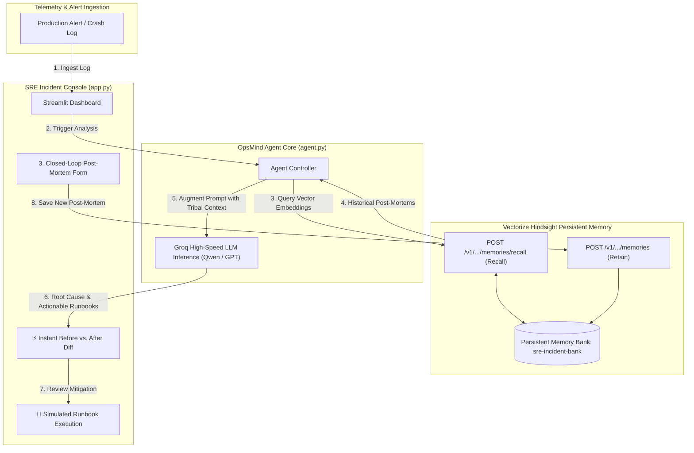

# OpsMind — Memory-Augmented SRE Incident Agent

[](https://github.com)
[](https://vectorize.io)
[](https://groq.com)
[](https://medium.com/@divyeshatla/eliminating-mttr-with-persistent-agent-memory-how-we-built-opsmind-using-vectorize-hindsight-fd5fe16848cc)

> 📖 **Read the Full Deep-Dive Article**:  
> [Eliminating MTTR with Persistent Agent Memory: How We Built OpsMind Using Vectorize Hindsight & Groq](https://medium.com/@divyeshatla/eliminating-mttr-with-persistent-agent-memory-how-we-built-opsmind-using-vectorize-hindsight-fd5fe16848cc)

---

## 🎯 Problem Statement & Solution (DevOps & SRE Track)

### The Problem
- **Tribal Knowledge Loss**: When production crashes at 3 AM, on-call SREs burn precious downtime trying to diagnose issues that another engineer solved weeks ago.
- **The Stateless LLM Fallacy**: Standard LLMs give textbook, generic troubleshooting advice (e.g. *"increase pod memory limits"* or *"check database connections"*) rather than pinpointing internal architectural culprits (e.g. *"unclosed gRPC client stream leak in `payment-svc`"*).
- **Recurring Outages**: Without persistent memory across triage cycles, organizations repeatedly suffer from the same configuration drifts and runtime bugs.

### The OpsMind Solution
**OpsMind** transforms SRE incident management into a **closed-loop learning system**:
1. **Recall**: When an alert or stack trace is detected, OpsMind queries **Vectorize Hindsight** persistent memory to retrieve past matching post-mortems and tribal runbooks.
2. **Diagnose**: **Groq** high-speed LLM inference synthesizes the live trace with organizational memory, outputting the exact root cause, targeted mitigation commands, and explicit memory attributions.
3. **Retain**: Once resolved, newly diagnosed post-mortems are indexed into Vectorize Hindsight on the fly, immediately accessible for future triage across the entire engineering organization.

---

## 🏗️ Architecture & Vectorize Hindsight Lifecycle



---

## 📊 Before vs. After: Memory Contrast

| Incident Scenario | Stateless LLM (Without Memory) | OpsMind (With Vectorize Hindsight) |
|---|---|---|
| **INC-8102 (Kubernetes OOMKilled Code 137)** | *"Pod exceeded memory. Edit deployment YAML to increase memory limits from 1.5Gi to 2Gi."* | **Identifies specific unclosed gRPC client stream leak in `payment-svc`** buffering payloads during peak traffic. Provides hotfix keepalive commands & rollout restart. |
| **INC-7940 (PostgreSQL Pool Starvation)** | *"Database reached connection limits. Consider scaling up instance or closing idle clients."* | **Identifies PgBouncer `session` vs `transaction` pool mode misconfiguration**. Provides `kubectl patch configmap` and `pkill -HUP pgbouncer`. |
| **INC-9210 (Kafka Rebalance Deadlock)** | *"Kafka consumer rebalanced. Verify network connectivity or increase brokers."* | **Pinpoints processing duration exceeding `max.poll.interval.ms`**. Provides precise consumer config tuning (`max.poll.records=250`). |

---

## 🚀 Getting Started

### 1. Prerequisites
- Python 3.10+
- Groq API Key ([console.groq.com](https://console.groq.com))
- Vectorize Hindsight API Key ([api.hindsight.vectorize.io](https://api.hindsight.vectorize.io))

### 2. Clone and Setup Virtual Environment
```bash
git clone https://github.com/<your-username>/opsmind-sre-agent.git
cd opsmind-sre-agent

# Create virtual environment
python -m venv venv

# Activate on Windows:
.\venv\Scripts\activate
# Activate on Linux/macOS:
source venv/bin/activate
```

### 3. Install Dependencies
```bash
pip install -r requirements.txt
```

### 4. Configure Environment Variables
Copy `.env.example` to `.env`:
```bash
cp .env.example .env
```
Update `.env` with your active keys:
```env
GROQ_API_KEY="gsk_..."
HINDSIGHT_API_KEY="hsk_..."
HINDSIGHT_BASE_URL="https://api.hindsight.vectorize.io"
HINDSIGHT_BANK_ID="sre-incident-bank"
```
> **Note**: If placeholder keys are left as `your_...`, OpsMind automatically activates a deterministic **Simulated Fallback Mode**, allowing the full workflow and tests to run offline.

---

## 🧪 Testing & Execution

### 1. Seed Historical Post-Mortems
Ingest realistic enterprise incidents (INC-8102, INC-7940, INC-9210) into Vectorize Hindsight:
```bash
python seed_data.py
```

### 2. Run Comprehensive Integration Tests
Execute the verification test suite:
```bash
pytest test_agent.py -v -s
```

### 3. Launch Interactive Streamlit UI
Start the interactive SRE incident response dashboard:
```bash
streamlit run app.py
```
Open **`http://localhost:8501`** in your browser.

---

## 🌟 Key Application Features

1. **Enterprise Impact Metric Cards**: Live indicators showcasing MTTR reduction (-78%), active recurrence detection, and indexed tribal runbooks.
2. **⚡ Instant Before vs. After Diff**: Side-by-side comparative analysis contrasting generic stateless LLM responses against context-aware Hindsight memory.
3. **🚀 Simulate Remediation (Dry Run)**: Interactive terminal animation validating safe cluster execution before production deployment.
4. **🔄 Closed-Loop Feedback Loop**: Immediate retention form to index newly resolved outages into Hindsight vector memory on the fly.

---

## 📝 Technical Publication
For a detailed technical breakdown of the architecture, memory retrieval mechanics, and benchmark results:
- **Medium Article**: [Eliminating MTTR with Persistent Agent Memory: How We Built OpsMind Using Vectorize Hindsight & Groq](https://medium.com/@divyeshatla/eliminating-mttr-with-persistent-agent-memory-how-we-built-opsmind-using-vectorize-hindsight-fd5fe16848cc)
